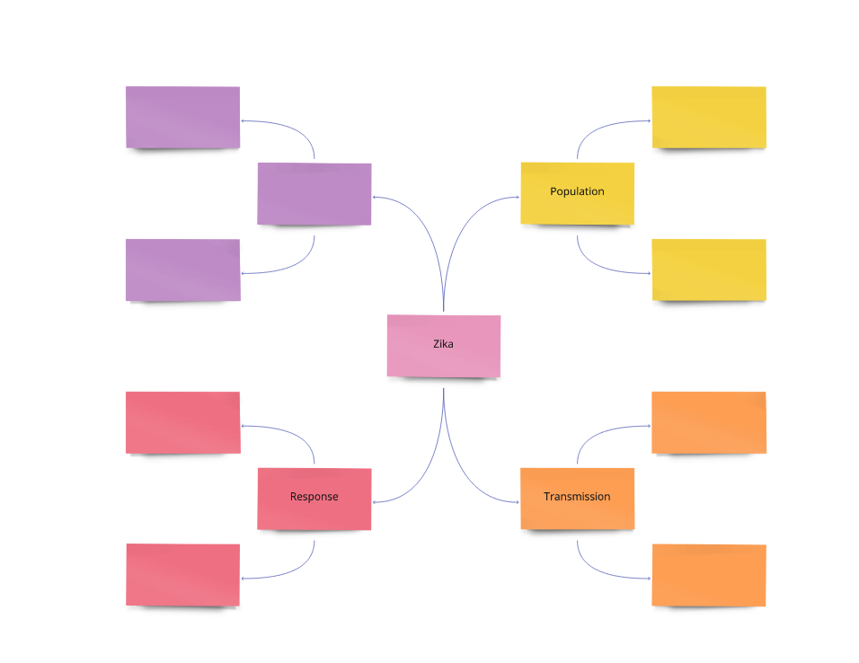
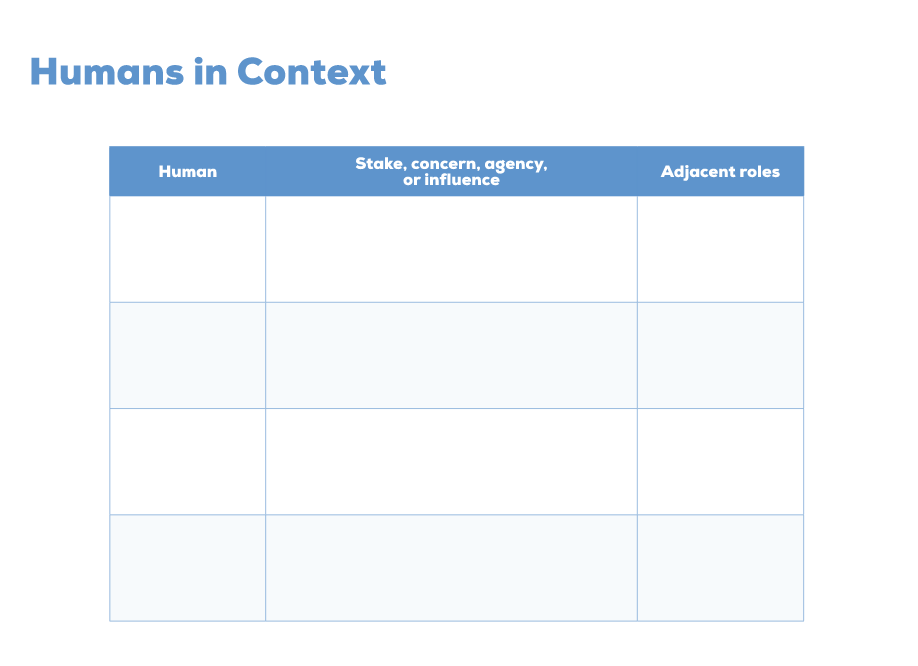

Exercises: Lesson 1
===================

In the following exercises,  you will complete a Conceptual Map and a “Humans in Context” chart 
for the Zika business case. We will use this business case throughout the Design Thinking portion 
of the course. There will be practice exercises that follow the reading/videos for each lesson. 
The exercises are highlighted below. Use the information from the lesson to help you complete 
the exercises.

Exercise 1: Conceptual Map
--------------------------

Use this template in Miro to create a Zika Conceptual Map. 

.. TODO: add real Miro link here

   Open this interactive template with the link above.

Exercise 2. Humans in Context
-----------------------------

Use this template in Miro to create a Zika Humans in Context chart. 

.. TODO: add real Miro link here

   Open this interactive chart with the link above.

